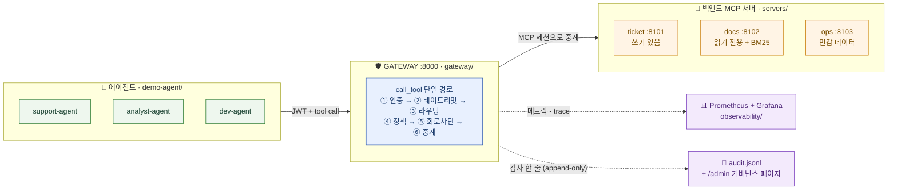
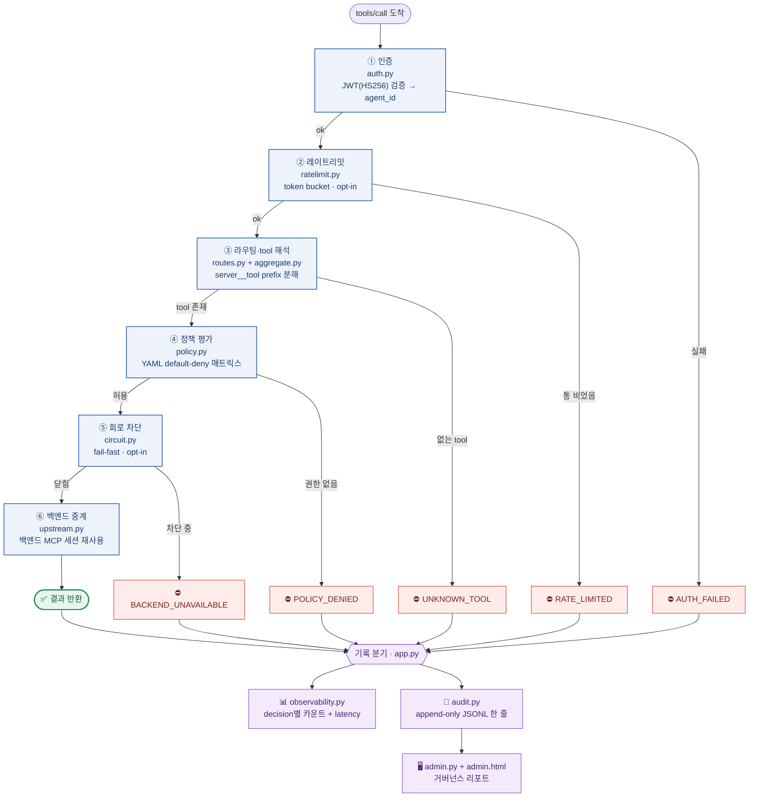
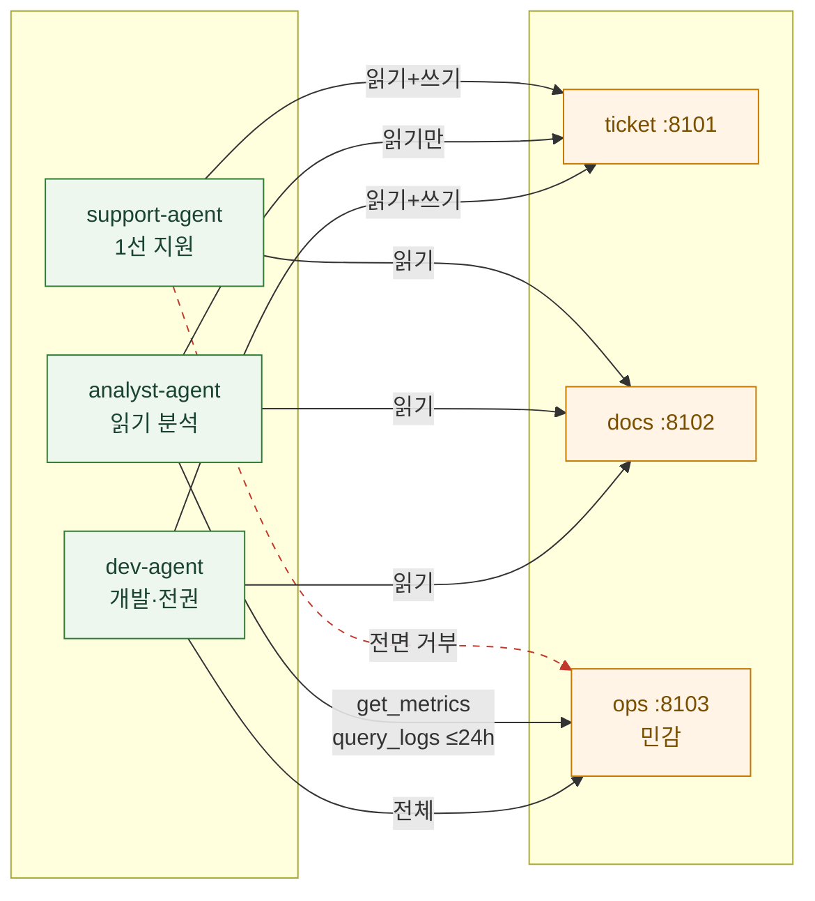
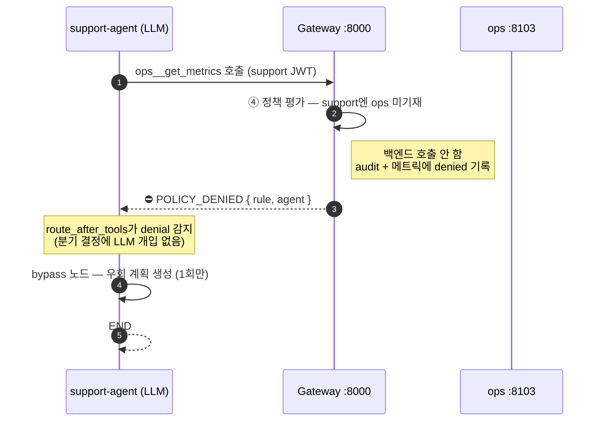

# AgentOps Gateway — 아키텍처 한눈에 보기

> **이 문서의 목적**: "이 시스템이 무엇으로 이루어져 있고, 각 조각이 어느 코드인지"를
> 코드를 안 열어보고도 이해하게 하는 것. 컴포넌트 → 폴더/파일 매핑이 핵심.
>
> 도식은 두 단계로 본다 — **2장 한눈에 보는 전체 그림**으로 큰 구조를 잡고,
> **3장 세부 컴포넌트 그림**으로 요청 하나가 내부에서 어떻게 처리되는지 따라간다.

---

## 1. 한 문장 요약

AI 에이전트가 외부 도구(MCP 서버)에 **직접 붙지 못하게 막고**, 모든 도구 호출을
Gateway 한 곳으로 모아 **인증 → 정책 → 라우팅 → 관측·감사**를 강제하는 시스템.

> 왜? 에이전트가 백엔드에 직접 연결되면 "누가 무엇을 호출했는지" 도구 호출 단위로
> 통제·기록할 방법이 없다. Gateway는 그 통제를 강제하는 **단일 길목**이다.

---

## 2. 한눈에 보는 전체 그림

에이전트는 Gateway만 바라보고, 백엔드는 Gateway만 받아들인다. 그 사이 **단일 길목**에서
모든 호출이 검사·기록된다. 점선은 곁가지 산출물(관측·감사)이다.



| 구역 | 무엇 | 폴더 |
|------|------|------|
| **에이전트** | Gateway에 붙는 클라이언트. 데모용 support-agent 1종 구현 | `demo-agent/` |
| **Gateway** | 모든 호출이 지나는 길목. 이 프로젝트의 본체 | `gateway/` |
| **백엔드 서버** | 실제 도구를 제공하는 MCP 서버 3종 | `servers/` |
| **관측 스택** | Prometheus + Grafana 대시보드 | `observability/` |

---

## 3. 세부 컴포넌트 그림 — 요청 하나가 지나는 길

에이전트가 도구 하나를 호출하면 **단 하나의 처리 경로**(`call_tool`)를 통과한다.
미들웨어 체인 같은 추상화 없이 6단계가 한 함수 안에 순서대로 끼워져 있고, **각 단계는
통과(초록)하거나 거부(빨강)한다.** 거부든 통과든 끝에서 반드시 관측·감사에 기록된다(파랑).



> **순서가 의미를 가진다**:
> - ③ tool 존재 확인을 ④ 정책보다 **먼저** 한다. 오타 난 tool을 "정책에 없으니 거부"로
>   잘못 분류하면 운영자가 권한 문제로 오해하기 때문. 없는 tool은 `UNKNOWN_TOOL`,
>   있는데 권한 없는 tool만 `POLICY_DENIED`.
> - 인증 실패도 그냥 끊지 않고 **감사·메트릭에 남긴다** — "거부 시도가 있었다"가 산출물.
> - ②·⑤(레이트리밋·회로차단)는 stretch 기능이라 env 미설정이면 통과(no-op)한다.

전체 조립과 6단계 배치는 **`gateway/src/gateway/app.py`** 의 `call_tool` 한 곳에 있다.
이 파일이 모든 컴포넌트를 묶는 **중심 허브**다.

### decision 5종 — 거부 코드 ↔ 어느 단계에서 났나

페이지·메트릭·감사 로그가 **같은 어휘**(이 5개 값)로 같은 사실을 기록한다.

| decision | 의미 | 발생 단계 | 도입 |
|----------|------|-----------|------|
| `allowed` | 통과 → 백엔드 결과 반환 | ⑥ | S3 |
| `auth_failed` | JWT 없음·위조·만료 | ① | S4 |
| `rate_limited` | 토큰 통이 비어 호출 차단 | ② | S5 (stretch) |
| `denied` (`POLICY_DENIED`) | tool은 있지만 권한 없음 | ④ | S4 |
| `error` (`UNKNOWN_TOOL`·`BACKEND_UNAVAILABLE`) | 없는 tool / 백엔드 불가 | ③·⑤ | S3 |

거부·오류 payload는 모두 `errors.py` 한 곳에서 만든다 — 본문은 `{"code": ..., ...필드}` JSON 단일 블록(파싱 계약).

---

## 4. 권한 매트릭스 (이 프로젝트의 심장)

`policies/policy.yaml`에 적힌 (에이전트 × 서버 × tool) 화이트리스트가 전부다.
**기재 안 된 조합은 자동 거부**(default-deny). 세 에이전트는 권한 단계를 시험하는 표본이다.



| 에이전트 | ticket | docs | ops | 시험하는 칸 |
|----------|--------|------|-----|-------------|
| **support-agent** | 읽기+쓰기 | 읽기 | ❌ 전면 거부 | "민감 서버는 못 건드린다"의 기준 (S6 거부 데모 주인공) |
| **analyst-agent** | 검색만 | 읽기 | `get_metrics`, `query_logs`(≤24h) | **인자 단위 정책** — 같은 tool도 인자값으로 거부 |
| **dev-agent** | 읽기+쓰기 | 읽기 | 전체 | 전권 기준선 |

> `analyst-agent`의 `query_logs`는 `max_range_hours: 24` 제약이 붙는다 — tool 이름만이
> 아니라 **인자값**(`range_hours`)까지 본다. 25시간을 요청하면 `POLICY_DENIED`.

---

## 5. 컴포넌트 ↔ 코드 매핑 (Gateway 내부)

`gateway/src/gateway/` 안의 각 파일 = 각 컴포넌트. 한 파일 = 한 책임.

| # | 컴포넌트 | 파일 | 한 줄 책임 |
|---|----------|------|-----------|
| 🎯 | **조립·진입점** | `app.py` | FastAPI 앱 조립, `call_tool` 단일 경로에 6단계 배치, `/metrics`·`/health` 노출 |
| ① | **인증** | `auth.py` | 사전발급 JWT(HS256) 검증 → agent_id. 실패 사유 3종(missing/invalid/expired) |
| ② | **레이트리밋** | `ratelimit.py` | 클라이언트별 token bucket. env 미설정이면 꺼짐 (stretch) |
| ③ | **라우팅** | `routes.py` | tool 해석 → 정책 → 중계까지의 흐름 제어. 6단계 중 ②~⑥의 실제 몸통 |
| ③ | **네임스페이싱·집계** | `aggregate.py` | `server__tool` prefix로 tool 합치기/분해. prefix가 라우팅 키 겸 라벨 |
| ④ | **정책 엔진** | `policy.py` | **프로젝트 핵심**. YAML default-deny 권한 매트릭스 강제 |
| ⑤ | **회로 차단기** | `circuit.py` | 백엔드별 연속 실패 시 차단(fail-fast). env 미설정이면 꺼짐 (stretch) |
| ⑥ | **백엔드 세션** | `upstream.py` | 백엔드당 MCP 세션 1개를 소유 task에서 유지·재사용 |
| 📊 | **관측성** | `observability.py` | Prometheus 메트릭 + OpenTelemetry trace |
| 📝 | **감사 로그** | `audit.py` | append-only JSONL 기록. 수정·삭제 경로 없음 |
| 🖥️ | **거버넌스 페이지** | `admin.py` + `templates/admin.html` | audit JSONL을 읽어 "누가 민감 tool 접근을 시도했나" 리포트 |
| 🧩 | **오류 형식** | `errors.py` | 모든 거부·오류 payload의 단일 생성 지점(파싱 계약) |

> **연결 관계 요약**: `app.py`가 모두를 조립한다 →
> `auth` → `routes`(`aggregate`·`policy`·`ratelimit`·`circuit`·`upstream` 사용) →
> `observability` + `audit` 기록. `admin`은 `audit`가 쓴 파일을 거꾸로 읽는다.

---

## 6. 컴포넌트 ↔ 코드 매핑 (Gateway 바깥)

### 에이전트 (`demo-agent/`)
| 파일 | 책임 |
|------|------|
| `src/demo_agent/graph.py` | support-agent를 LangGraph StateGraph로 구현. **거부 분기를 LLM이 아닌 그래프 구조로 보장** — `POLICY_DENIED` 감지 시 bypass 노드로 라우팅 |
| `src/demo_agent/mcp_client.py` | Gateway에 support-agent JWT로 연결하는 MCP 클라이언트 |

### 백엔드 MCP 서버 (`servers/`)
세 서버는 권한 매트릭스를 테스트하기 위한 **역할별 표본**이다.

| 서버 | 포트 | 폴더 | 권한 매트릭스에서의 역할 |
|------|------|------|------------------------|
| **ticket** | 8101 | `servers/ticket/` | **쓰기(create/update) 있는** 유일한 서버 → "읽기는 되는데 쓰기는 안 되는" 칸 테스트 |
| **docs** | 8102 | `servers/docs/` | **읽기 전용** → 누구나 읽는 기준선. BM25 검색 탑재 |
| **ops** | 8103 | `servers/ops/` | **가장 민감** → support-agent에겐 전부 차단. S6 거부 데모의 무대 |

각 서버 폴더 구조(동일 패턴): `src/<name>_server/server.py`(MCP 정의) + 데이터/검색 모듈.

### 정책·관측·운영
| 자산 | 경로 | 역할 |
|------|------|------|
| **권한 정책** | `policies/policy.yaml` | 3 에이전트 × 3 서버 허용 조합(화이트리스트). `policy.py`가 읽음 |
| **관측 스택** | `observability/` | `prometheus.yml`(스크레이프 설정) + `grafana/`(대시보드·프로비저닝) |
| **셋업 스크립트** | `scripts/` | `issue_tokens.py`(JWT 발급), `e2e_demo.py`(트래픽 생성), `check_*.py` |
| **풀스택 기동** | `docker-compose.yml` | gateway + 백엔드 3 + Prometheus + Grafana를 한 번에 |

---

## 7. 대표 시나리오 — 거부를 만났을 때 (S6 데모)

support-agent가 권한 없는 `ops`를 건드리면 Gateway가 `POLICY_DENIED`로 막고, 에이전트는
**LLM 판단이 아니라 그래프 구조**로 우회 계획 노드로 빠진다. "거부가 곧 산출물"인 흐름.



> 핵심 계약(`graph.py`): `tools` 노드가 `POLICY_DENIED`를 감지하면 `state["denial"]`에
> payload를 박고, `route_after_tools`가 그걸 보고 `bypass`로 라우팅한다. LLM은 이 분기에
> 관여하지 않으므로, 정책 거부 대응이 **결정론적으로** 재현된다.

---

## 8. 폴더 지도 (전체)

```
AgentOps_Gateway/
├── gateway/                  ← 본체. Gateway 앱
│   └── src/gateway/
│       ├── app.py            🎯 조립·진입점 (6단계 단일 경로)
│       ├── auth.py           ① 인증
│       ├── ratelimit.py      ② 레이트리밋 (stretch)
│       ├── routes.py         ③ 라우팅 흐름
│       ├── aggregate.py      ③ tool 네임스페이싱·집계
│       ├── policy.py         ④ 정책 엔진 (핵심)
│       ├── circuit.py        ⑤ 회로 차단기 (stretch)
│       ├── upstream.py       ⑥ 백엔드 세션
│       ├── observability.py  📊 메트릭·trace
│       ├── audit.py          📝 감사 로그
│       ├── admin.py          🖥️ 거버넌스 페이지
│       ├── errors.py         🧩 오류 형식
│       └── templates/admin.html
│
├── demo-agent/               ← 에이전트(클라이언트) 데모
│   └── src/demo_agent/{graph,mcp_client}.py
│
├── servers/                  ← 백엔드 MCP 서버 3종
│   ├── ticket/  (:8101, 쓰기 있음)
│   ├── docs/    (:8102, 읽기 전용 + BM25)
│   └── ops/     (:8103, 민감 데이터)
│
├── policies/policy.yaml      ← 권한 매트릭스(default-deny)
├── observability/            ← Prometheus + Grafana
├── scripts/                  ← 토큰 발급·e2e·점검 스크립트
├── docker-compose.yml        ← 풀스택 기동
└── tests/                    ← unit + integration (97 그린)
```

---

## 9. 더 깊이 보려면

각 컴포넌트의 **왜 이렇게 설계했나**는 코드 모듈 docstring과
`docs/learning/`(기능별 코드 해부)에 있다:
`gateway-core.md`, `auth.md`, `policy.md`, `audit.md`, `observability.md`,
`resilience.md`(레이트리밋·회로 차단), `admin.md`, `backend-servers.md`, `demo-agent.md`.
